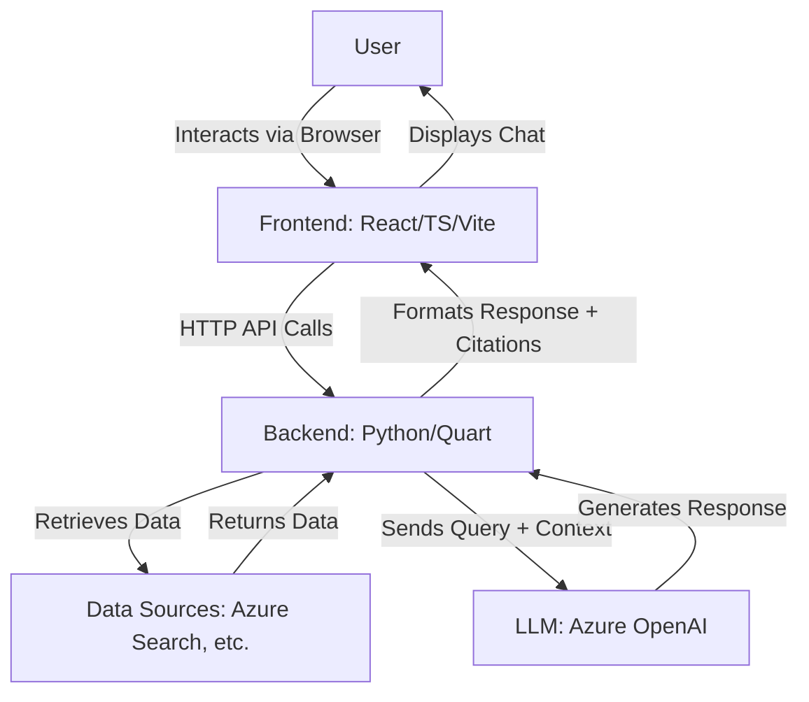

# RAGKA v2 - System Patterns and Architecture

## 1. System Architecture Overview

RAGKA v2 employs a client-server architecture:

-   **Frontend (Client-Side):** A web-based chat interface built with React, TypeScript, and Vite. It uses Fluent UI components for the user interface elements. The frontend is responsible for user interaction, sending queries to the backend, and displaying responses including formatted citations.
-   **Backend (Server-Side):** A Python-based application using Quart (an async Flask-compatible framework). It handles API requests, orchestrates the RAG pipeline, interacts with data sources and the LLM, and formats the final response.
-   **Data Sources:** Various configurable knowledge bases such as Azure Cognitive Search, Elasticsearch, etc. These store the information the RAG system retrieves.
-   **LLM Service:** Azure OpenAI service provides the generative capabilities for answering questions based on retrieved context.

## 2. Key Technical Decisions

-   **Frontend Framework:** React with TypeScript for a modern, component-based, and type-safe frontend development experience. Vite is used for fast builds and development.
-   **UI Library:** Microsoft's Fluent UI React components for a consistent look and feel, and pre-built accessible components.
-   **Backend Framework:** Quart for its asynchronous capabilities, suitable for I/O-bound operations like interacting with external services (data sources, LLMs). Its Flask compatibility allows leveraging the Flask ecosystem.
-   **RAG Pattern:** The core of the application is the Retrieval Augmented Generation pattern, which combines information retrieval with large language models to provide context-aware and sourced answers.
-   **Modular Backend:** The backend is structured with distinct modules for different concerns (e.g., `citation_processor.py`, `utils.py`), promoting maintainability.

## 3. Design Patterns in Use

-   **Component-Based Architecture (Frontend):** The React frontend is built using reusable components (e.g., `QuestionInput`, `Answer`).
-   **Model-View-Controller (MVC) like (Frontend):** React components (View) manage their own state and logic, interacting with services/contexts (Model/Controller aspects) for data and actions. `AppStateContext` acts as a global state provider.
-   **Service Layer (Backend):** Backend utilities and processors (like `CitationProcessor`) act as services that encapsulate specific business logic.
-   **Strategy Pattern (Data Sources):** The system is designed to support multiple data source types, implying a strategy or adapter pattern for interacting with different search backends.
-   **Asynchronous Programming (Backend):** Quart enables async request handling, crucial for non-blocking operations with external services.

## 4. Component Relationships (Key Examples)

-   **`frontend/src/pages/chat/Chat.tsx`:** Orchestrates the main chat view. It uses:
    -   **`frontend/src/components/QuestionInput/QuestionInput.tsx`:** For user input. This component handles its own state for the text and image uploads, and calls an `onSend` prop (passed from `Chat.tsx`) to submit the query.
    -   **`frontend/src/components/Answer/Answer.tsx`:** For displaying responses from the backend.
-   **`app.py` (Backend):** The main Quart application. Defines API endpoints like `/conversation`. It uses:
    -   **`backend/utils.py`:** For formatting responses from the LLM, including integrating citation data.
    -   **`backend/citation_processor.py`:** A dedicated module for handling the logic of preparing context with source tags, filtering cited sources, and renumbering citations.
    -   **`backend/settings.py`:** For managing configurations, including LLM parameters and data source details.

## 5. Critical Implementation Paths

-   **User Query to Response Flow:**
    1.  User types in `QuestionInput.tsx`.
    2.  `onSend` callback in `Chat.tsx` sends the query to `app.py` (`/conversation` endpoint).
    3.  `app.py` prepares arguments, interacts with the chosen data source to retrieve relevant documents.
    4.  `app.py` sends the query and retrieved documents (context) to Azure OpenAI.
    5.  Azure OpenAI returns a response.
    6.  `backend/utils.py` (using `backend/citation_processor.py`) processes this response to format it, extract/renumber citations, and prepare the `sources` array.
    7.  `app.py` sends the formatted JSON response back to `Chat.tsx`.
    8.  `Chat.tsx` updates its state, causing `Answer.tsx` and other components to re-render with the new information.
-   **Input Text Box Dynamics (`QuestionInput.tsx`):**
    1.  The Fluent UI `TextField` component is used with `multiline`, `autoAdjustHeight`, `rows={1}`, and `maxRows={6}` props.
    2.  CSS in `QuestionInput.module.css` styles the container and text area, removing fixed height from the container to allow it to grow, and applying `border-radius`.
    3.  As the user types, `autoAdjustHeight` (a Fluent UI feature) handles the expansion of the text area up to `maxRows`. Beyond that, a scrollbar appears.
